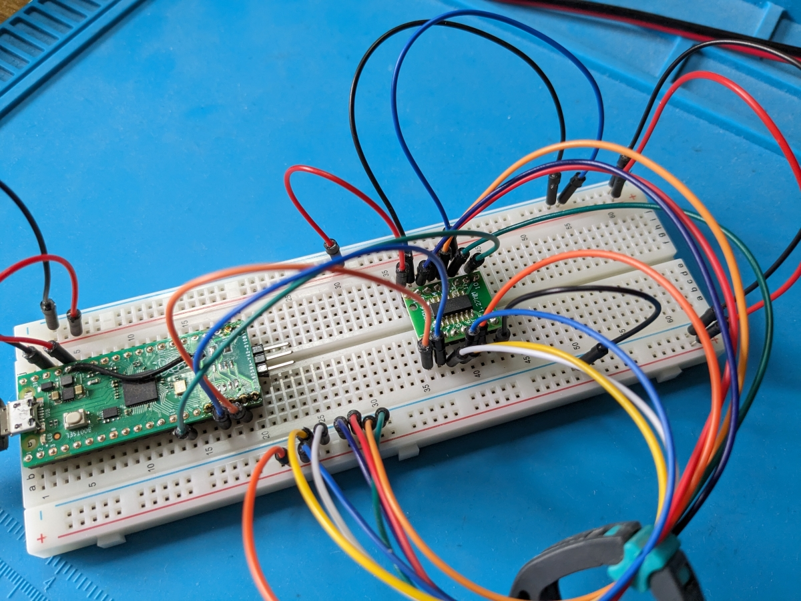

# pico-shift-register-74xx165

This is a piece of code which drives a 74xx165 shift register with a
Raspberry Pi Pico, from both C and PIO.  It doesn't really do anything
other than demonstrate the techniques, but it might be useful to
someone.

## The 74xx165 Shift Register

Just briefly then, because this type of device is discussed at length
elsewhere, the idea behind the shift register is to convert parallel
GPIO data into serial data, thereby saving GPIO pins.

Suppose you want to capture the 8 bits of an 8-bit data bus. Typically
you'd connect the 8 data lines to 8 of the Pico's GPIOs, then, when
you want the data, you grab the state of all those GPIOs in one atomic
operation. That's fine if you have the GPIOs free. If you're short on
GPIOs you can't really use this approach. In this case you can use a
shift register, which will allow you to capture the state of the 8
data lines using only 2 (maybe 3) GPIOs.

With the shift register solution you connect the 8 data lines to the
chip's 8 inputs, then when you want the data bus status you pulse
another input pin on the shift register. The shift register will then
immediately "latch" the state of all 8 data lines. You then retrieve
the 8 data bits by reading them serially, one at a time using a
timing clock pulse, from the shift register's single output pin.

The advantage is that you save several GPIOs. The disadvantage is that
it takes an appreciable amount of time to read the bits out one by
one.

## Aim of my project

I wanted to know how quickly I could read the state of 8 data lines
from a shift register using the Raspberry Pi Pico's PIO capability.

## My Device

I used a
[74LV165A](https://www.mouser.co.uk/ProductDetail/771-LV165AD118) for
this project, simply because I had one. There are other versions with
different capabilities, speeds, voltage ranges, etc.

My variant was a SOIC package, so I used a SOIC->DIP converter board
so I could mount it on a breadboard.

## Differing names

I've looked at the Nexperia datasheet, since that's the manufacturer
of the device I've got, and the Texas Instruments data sheet, since
they do a borderline identical product and have a much better written
datasheet. The two datasheets sometimes use different names for the
signals. Be aware of this, my explanations and names in the code might
get confusing otherwise.

## Set up

I have the 8 data input lines to my 74LV165 tied to either 3V3 or GND.
Pick a pattern of 1s and 0s you'll recognise, it makes it easier to
see at a glance if it's working.

I've got the 74LV165's clock line (called CP or CLK) connected to Pico
GPIO13, the 74LV165's parallel load line (called PL or SH/LD)
connected to Pico GPIO14, and the 74LV165's output (which is an input
to the Pico) (called Q) connected to the Pico's GPIO10.

Ignore the wires soldered across the Pico in this photo:



It's an old one which has been used for all sorts of stuff. :)

## The C Code

The C code is pretty trivial and is mostly supplied as a means of
establishing that the device is working. No effort been put
into the timings here, just crude pauses.

Build it with the usual:

```
mkdir build
cd build
cmake -DCMAKE_BUILD_TYPE=Debug ..
make
```

and program the UF2 file into the Pico. Depending on which of the
shift register's inputs you have connected to 3V3 and GND, the stdio
output will be something like

```
76543210
11000000
```

I have the top 2 data lines tied to 3V3, the rest tied to GND.

The code pulses the "parallel load" line, sometimes know at the "latch",
with this:


```
gpio_put( SH_LD_GP, 0 );
sleep_ms(1);
gpio_put( SH_LD_GP, 1 );
```

i.e. it pulls that signal low for a moment. That causes the 8 data
lines to be latched in the shift register. I then "clock out" those
data lines from the shift register's single output bit using this:

```
loop:
  uint8_t q = gpio_get( Q_GP );
  ...
  gpio_put( CLK_GP, 1 );
  sleep_ms(1);
  gpio_put( CLK_GP, 0 );
```

This collects the data bit from the Q pin's GPIO, then toggles the
clock line high then low. Toggling the clock line causes the shift
register to put the next of the data bits on the Q pin, so loop round,
fetch that data bit, and do it again 8 times in total.

If this works you can move on to the PIO version which is where the
good stuff is.

## The PIO Code

I won't discuss setting up the PIO code, the reader is assumed to know
that sort of thing. Build it as per the C version:

```
mkdir build
cd build
cmake -DCMAKE_BUILD_TYPE=Debug ..
make
```

The aim here is to read the shift register as efficiently as possible.
There's a PIO program to interact with the device, which, once
complete, returns the 8-bit data value back to the C code using
DMA. This approach leaves the core completely free. The PIO drives the
shift register, the DMA handles the result byte, and the core code
just finds the result byte waiting for it in a local variable.

The DMA is configured to receive an 8-bit byte from the PIO's FIFO
directly into a local variable. The DREQ is set up such that when the
PIO pushes the byte onto the FIFO, the DMA engine indicates to the
core that the data is ready and waiting for it.

The PIO starts with:

```
pull block       side 0x00
```

which causes the PIO engine to sit and wait. When it's ready to go,
the C code pokes the PIO state machine with:

```
pio_sm_put_blocking(pio0, shift_reg_sm, 1);
```

This mechanism is just for test. In a real world example the PIO would
likely be triggered by some hardware event indicating that the data has
arrived.

As soon as the C code has started the PIO state machine the C code goes to
sleep, waiting for the DMA to wake it up:

```
dma_channel_wait_for_finish_blocking( dma_chan );
```

In this example the core code hasn't got anything else to do.

The PIO code is heavily commented with all my notes from my timings,
calculations and experiments. The approach is to use SET instructions
to toggle the latch line as briefly as possible, then an IN to pick up
the Q bit, then a SIDE SET to toggle the clock line. The data is returned
to the core using a PUSH, which puts the result value on the core's
input FIFO and triggers the DMA.

8 PIO instructions. 63 RP2040 clock cycles. Impressive.

## Oscilloscope trace

Here's the capture from the 'scope:


The signal comes from a test pin I blip at key moments in the process.

There are two sections to that trace. The first high-then-low section
is the where the C code pokes the PIO to wake it up. That's not really
part of the shift register transaction.

It then goes low and high again. That's the point where the PIO has
been started and the core is waiting for the shift register's response
from the PIO. The signal goes back low when the DMA is woken up with
the result from the PIO.

It takes the PIO about 600ns to drive the shift register and get the
output byte back to the core. That's about as fast as my 74LV165A can
go.
